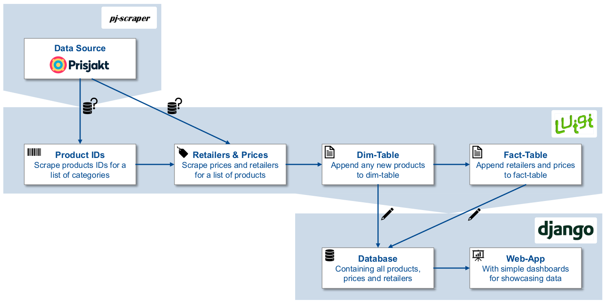
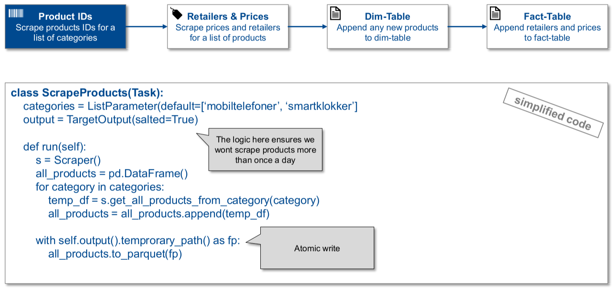
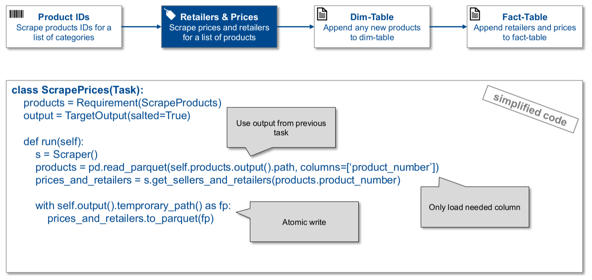
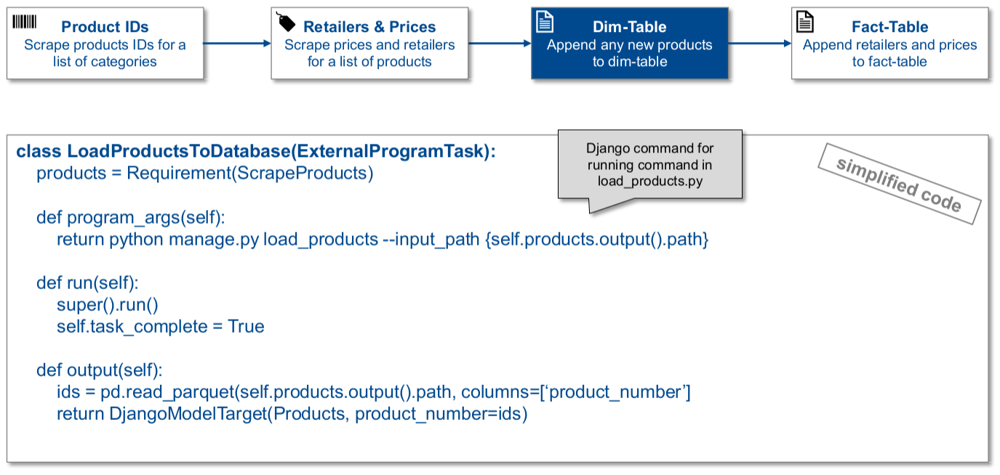
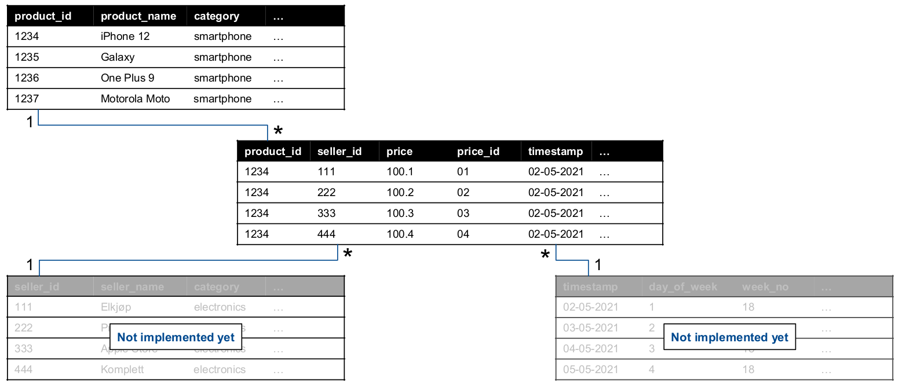

.. Final Project, CSCI E-29 documentation master file, created by
   sphinx-quickstart on Wed Apr 28 18:13:52 2021.
   You can adapt this file completely to your liking, but it should at least
   contain the root `toctree` directive.

Welcome to my Final Project
====================================================================

.. start-badges

.. list-table::
    :stub-columns: 1
    :widths: 10 40

    * - Build
      - | |travis| |codeclimate| |codeclimate2|
    * - Docs
      - | |readthedocs|

.. |travis| image:: https://travis-ci.com/mdhor/2021sp-final-project-mdhor.svg?branch=master
    :alt: Travis-CI Build Status
    :target: https://travis-ci.com/github/mdhor/2021sp-final-project-mdhor

.. |codeclimate| image:: https://api.codeclimate.com/v1/badges/7469f8aaac5c1798b9e4/maintainability
   :target: https://codeclimate.com/github/csci-e-29/2021sp-final-project-mdhor
   :alt: CodeClimate Quality Status

.. |codeclimate2| image:: https://api.codeclimate.com/v1/badges/7469f8aaac5c1798b9e4/test_coverage
   :target: https://codeclimate.com/github/csci-e-29/2021sp-final-project-mdhor
   :alt: CodeClimate Coverage Status

.. |readthedocs| image:: https://readthedocs.org/projects/2021sp-final-project-mdhor/badge/?version=latest
   :target: https://2021sp-final-project-mdhor.readthedocs.io/en/latest/?badge=latest
   :alt: Documentation Status

.. end-badges

----------------------------------

Introduction
============

Pricing and assortment data is highly valuable but can be difficult and expensive to obtain, especially for smaller retailers.

Because of digitalization, the importance of pricing and assortment data has increased. An insight into a companys online presence is crucial for success.
This is especially true after COVID-19, where smaller retailers are forced to differentiate themselves online.
Without large IT-budgets, gaining good data surrounding ones own as well as competitors pricing and assortment can be difficult.

Data on pricing and assortment can be used for several insightful analyses. One example is pricing analysis to answer questions like "Where do our prices differ from competitors?".
Another example is assortment analysis; "How does our assortment compare to competitors?".

prisjakt.no is a leading actor within price comparison in Norway. It acts as an "all-inclusive" shopping mall, so the consumer does not have to browse many different website, by comparing pricing
from many different retailers. The products range widely from electronics, to clothing, to vehicles.

-------------------------------------

Quick-Start
============

If you want to test the project quickly, do the following:

#. Clone the repo and create an environment using the Pipfile

#. Run the following commands:

   * pipenv run python manage.py migrate

   * pipenv run python -m final_project

   * pipenv run python manage.py runserver

#. Enter the server and check out a visual

-------------------------------------

Aim of Project
==============

The project aims to create a full stack data science pipeline, from mining prisjakt.no data all the way to showing results in a web application.
The project can be split into four main workflows:

* Developing pj-scraper, a library that will act as a simplified interface for scraping of prisjakt.no
* Organizing the pipeline into Luigi Tasks, all the way from handling scraping to appending data in a Django database
* Creating a Django database that will contain the data that has been scraped from prisjakt.no
* Developing a simple Django web app to show a simple example of how the data can be used for analysis

----------------------------------

High-Level Workflow
===================

-------------------------------------

pj-scraper
==========

The pj-scraper library is centered around the use of a single class, with methods that handle to main tasks:

* Getting all products from a category, e.g. all from the category "smartphones"
* Getting all retailers and prices for a product, e.g. all from the product "iPhone 12"

See repo on Github here: https://github.com/mdhor/pj-scraper#overview

.. autoclass:: pj_scraper.scraper.Scraper
   :members:
   :undoc-members:
   :show-inheritance:

-------------------------------------

Luigi Workflow
==============

The workflow consists of four main tasks:

* Scrape products from a list of categories
* Scrape retailers and prices for all products
* Append any new products to database
* Append all prices to the database with a new timestamp

The two tasks handling scraping both write to a parquet target which is salted. The salt is a function of the parameters,
as well the current day of the year, to avoid scraping prices more than once a day. This could in future be changed to be once per hour or even per minute.

Below are descriptions of each tasks, with pseudo code.

**Scrape product IDs**

**Scrape retailers and prices**

**Load product IDs to DB**

**Load retailers and prices to DB**

.. image:: ./images/task_load_prices.png
  :width: 800

-------------------------------------

Django Database
===============

The database is structured as a star schema. The fact table contains prices per retailer per timestamp per product.
The unique identifier for this table is the combination of timestamp, retailer and product. In future, this schema is
easily expandable with new dim-tables containing information on e.g. the retailers. Here is the schema:

-------------------------------------

Django Web-App
==============

The web app for now only contains two simple visuals:

* A line chart showing the historical prices of an iPhone 12, for the 10 retailers with lowest price today
* A scatter plot showing retailer rating on the x-axis and price in the y-axis

The visuals have been created using the following procedure:

#. Query the DB to get only the needed data for the visual
#. Load data into a pandas dataframe
#. Use matplotlib to create the graph
#. Use mpld3 to convert the graph into html

-------------------------------------

Conclusion and Main Learnings
==============================

* Developing pj-scraper
   * The libraries requests and BeautifulSoup4 has been used to mine unstructured data from prisjakt.no
   * Two main functions have been developed: Getting all products from a category and getting all retailers and prices for a product or list of products
   * The tools sdist and Twine has been used to publish pj-scraper to PyPi for easy installation
* Organizing the workflow into Luigi Tasks
   * Four main tasks has been developed that encapsulates the full data science pipeline
   * The first two tasks handles the scraping of products, retailers and prices, utilizing the pj-scraper library
   * The last two tasks handles appending the scraped data to the Django database, using Django commands
* Creating a Django database
   * A Django database has been developed which contains two tables: Products and Prices
   * The Prices table is a fact table containing prices for each product and retailer for a given timestamp
   * The Products table is a dim-table containing information about products, like product name and category
* Developing a simple Django web app
   * A simple web app has been developed, to showcase how the system could be used in practice
   * To avoid unneseccary boilerplate and simplify visuals creation, mpld3 has been used
   * Two simple visuals has been made, that shows two interesting analyses

-------------------------------------

Future Work
==============================

Before this project would have real value, two main things are missing:

* Move the system to the cloud and schedule Luigi to run with certain intervals
* Create insightful analyses based on inputs from potential users of the system
