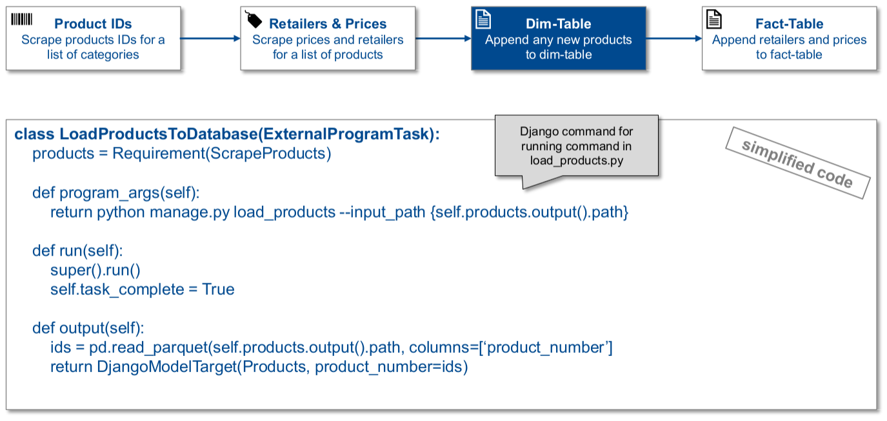

Introduction
=================

The workflow consists of four main tasks:

#. Scrape products from a list of categories

#. Scrape retailers and prices for all products

#. Append any new products to database

#. Append all prices to the database with a new timestamp

The two tasks handling scraping both write to a parquet target which is salted. The salt is a function of the parameters,
as well the current day of the year, to avoid scraping prices more than once a day. This could in future be changed to be once per hour or even per minute.

Below are descriptions of each tasks, with pseudo code.

**Scrape product IDs**

.. image:: ./images/product_ids.png
  :width: 800

**Scrape retailers and prices**

.. image:: ./images/scrape_prices.png
  :width: 800

**Load product IDs to DB**

**Load retailers and prices to DB**

.. image:: ./images/task_load_prices.png
  :width: 800
